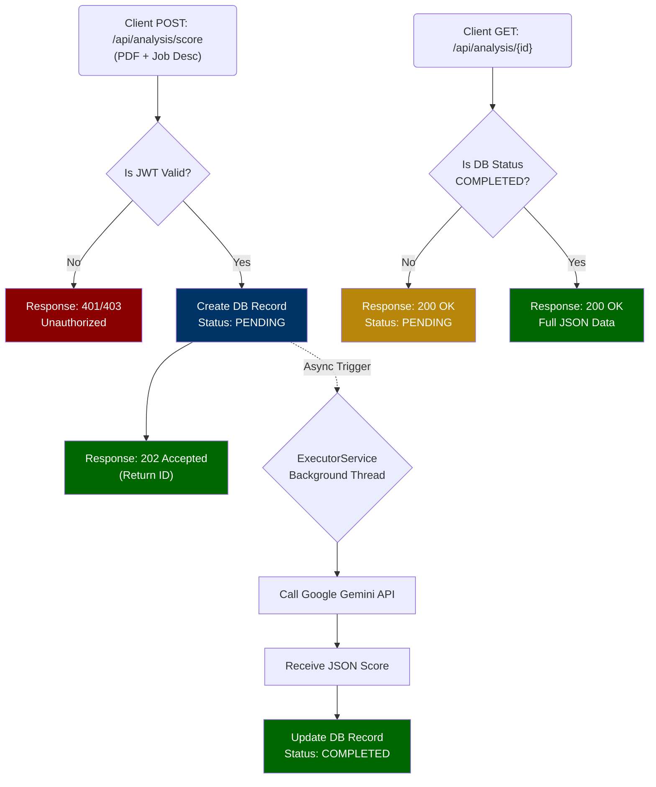
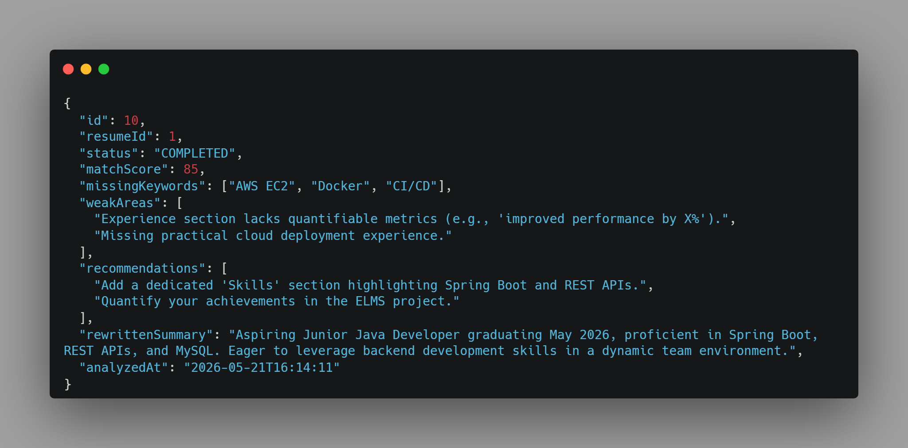
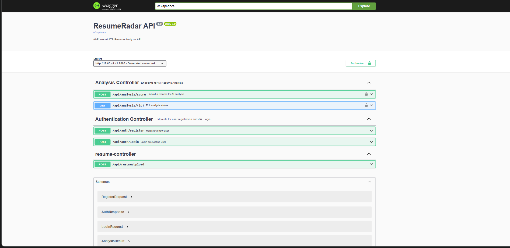
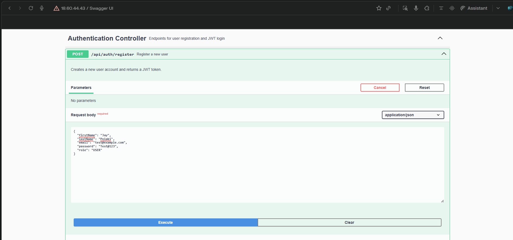
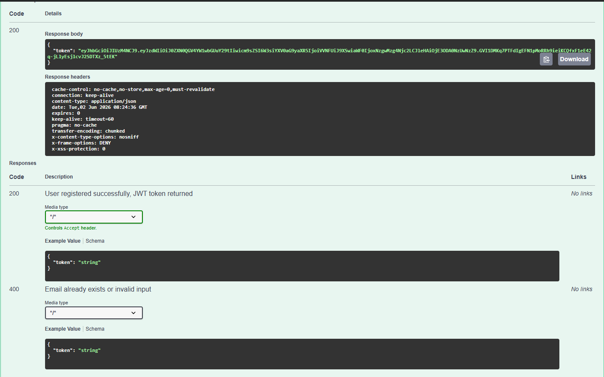

# 🎯 ResumeRadar: AI-Powered ATS Resume Analyzer

> **Backend-first AI resume scoring API for ATS-style analysis using Google Gemini.**


**ResumeRadar** is an intelligent, backend-heavy Spring Boot application designed to analyze resumes (PDFs) against specific job descriptions. Using **Google's Gemini AI**, the system parses resumes, calculates ATS match scores, identifies missing keywords, and provides actionable recommendations—all processed asynchronously to ensure a highly responsive user experience.

---

## 👨‍💻 Why I Built This & What It Shows

**The Problem:** Standard resume parsers rely on outdated, strict keyword matching. I wanted to build a modern backend that leverages LLMs (Google Gemini) to analyze resumes contextually, just like a real tech recruiter would.

**Key Engineering Achievements:**
- **Asynchronous Architecture:** Architected an ATS scoring API using Java 21 and Spring `@Async`, integrating Google Gemini LLM to process PDF resumes in background threads and instantly return HTTP `202 Accepted` responses.
- **Security & Reliability:** Secured REST API endpoints with stateless JWT authentication and implemented centralized exception handling via `@RestControllerAdvice` to ensure consistent JSON error payloads.
- **Modern DevOps:** Containerized the application with Docker Compose and established a GitHub Actions CI/CD pipeline for automated deployments to an AWS EC2 instance.
- **Testing:** Wrote comprehensive unit tests using JUnit 5 and Mockito, ensuring robust core service-layer logic and data integrity.

---

## ✨ Core Features

* **🔐 Secure Authentication:** Stateless JWT (JSON Web Token) based user registration and login.
* **📄 Document Parsing:** Native PDF text extraction using Apache PDFBox.
* **🧠 AI Analysis:** Integration with Google Gemini API via Spring WebClient to generate structured JSON analysis.
* **⚡ Asynchronous Processing:** Heavy AI workloads are offloaded to background Virtual Threads (`ExecutorService`).
* **🔄 Status Polling:** Implements the `PENDING` → `COMPLETED` polling pattern for long-running AI tasks.
* **🛡️ Global Exception Handling:** Predictable JSON error responses managed centrally.
* **🧪 Automated Testing:** Service-layer logic tested comprehensively using the AAA pattern with Mockito.

---

## 🏗️ Architecture: Async AI Polling Flow

To handle variable AI response times without hanging HTTP requests, ResumeRadar uses a robust asynchronous polling architecture:



---

## 💡 Key Technical Decisions

1. **Virtual Threads over Standard ThreadPool:** Used Java 21 Virtual Threads via `ExecutorService` to handle background AI processing. This drastically reduces memory overhead compared to OS-level threads when dealing with high I/O (API calls).
2. **Global Exception Handling:** Replaced generic Spring Boot HTML error pages with a centralized `@RestControllerAdvice` class. Custom exceptions (`ResourceNotFoundException`) ensure the frontend always receives a clean, standardized JSON `ErrorResponse` DTO.
3. **WebFlux WebClient over RestTemplate:** Used `WebClient` for non-blocking HTTP calls to the external Gemini API, modernizing the network layer.

---

## 📊 Example AI Output

When the analysis is complete, the API returns a highly structured, actionable JSON payload parsed directly from the Gemini API:



---

## ☁️ Live Deployment

The backend API is deployed natively on **AWS EC2 (Ubuntu, t3.micro)** in the Asia Pacific (Hyderabad) region.

| | Detail |
|---|---|
| **Live API Base URL** | `http://18.60.44.43:8080` |
| **Platform** | AWS EC2 — Ubuntu 22.04 |
| **Instance Type** | t3.micro (1 vCPU, 1GB RAM + 1GB SWAP) |
| **Database** | MySQL 8.x running in Docker Container |
| **Process Management** | Docker Compose Orchestration (`docker compose up -d`) |
| **CI/CD** | GitHub Actions Pipeline (Build → Push to Docker Hub) |

### Quick Test (No Auth Required):
```bash
curl -X POST http://18.60.44.43:8080/api/auth/register \
  -H "Content-Type: application/json" \
  -d '{"firstName":"Jay","lastName":"Polaki","email":"test@example.com","password":"Test@123","role":"USER"}'
# Returns: { "token": "eyJ..." }
```

---

## 🚀 Setup & Installation (Docker)

The easiest way to run ResumeRadar locally is using Docker Compose.

### 1. Prerequisites
* Docker & Docker Compose installed
* Google Gemini API Key

### 2. Configure Environment
Create a hidden `.env` file in the root directory and add your API key:
```env
GEMINI_API_KEY=your_actual_google_api_key_here
```

### 3. Start the Orchestra
Run the application and database together in the background:
```bash
docker-compose up -d
```
The server will start on `http://localhost:8080`. MySQL will be available on port `3306`.

---

## 📖 Interactive API Documentation (Swagger UI)

The API is fully documented using OpenAPI 3.0 (Swagger). The live deployment includes an interactive Swagger UI where you can explore endpoints, view schema definitions, and securely inject your JWT token to test the API directly from the browser.

### API Overview


### Detailed Schema & Responses



---

## 🔌 API Endpoints

### Authentication
| Method | Endpoint | Description | Auth Required |
|--------|----------|-------------|---------------|
| `POST` | `/api/auth/register` | Register a new user | ❌ No |
| `POST` | `/api/auth/login` | Login and receive JWT | ❌ No |

### Resume Analysis
| Method | Endpoint | Description | Auth Required |
|--------|----------|-------------|---------------|
| `POST` | `/api/analysis/score` | Upload PDF (`file`) and `jobDescription`. Returns ID instantly. | ✅ Yes (JWT) |
| `GET` | `/api/analysis/{id}` | Poll for analysis status and final score JSON. | ✅ Yes (JWT) |

---

## 🚧 Upcoming Features (Roadmap)
- [x] **Automated Testing:** Full test coverage using JUnit 5 and Mockito.
- [x] **AWS Deployment:** Backend deployed live on AWS EC2 (Ubuntu, t3.micro) at `http://18.60.44.43:8080`.
- [x] **Dockerization:** Containerizing the application and database using Docker Compose, pushed to Docker Hub via GitHub Actions CI/CD.
- [ ] **Caching:** Redis integration to cache repetitive resume analyses.


---
*Developed by [JayaKrishna Polaki (Jay)](https://www.linkedin.com/in/jayakrishna-polaki/)*
