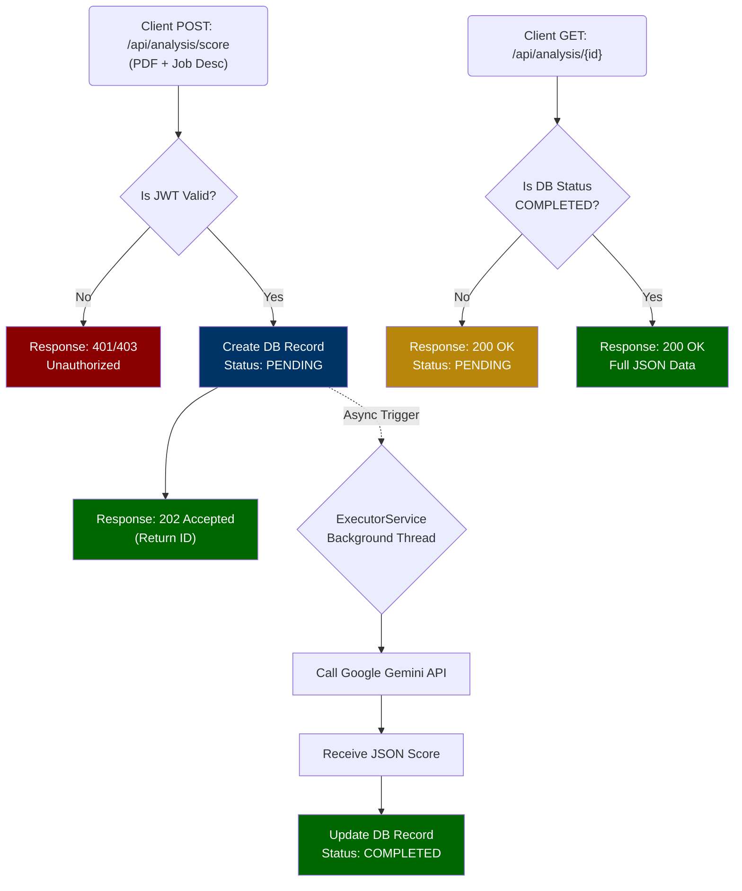

# 🎯 ResumeRadar: AI-Powered ATS Resume Analyzer

> **Backend-first AI resume scoring API for ATS-style analysis using Google Gemini.**


**ResumeRadar** is an intelligent, backend-heavy Spring Boot application designed to analyze resumes (PDFs) against specific job descriptions. Using **Google's Gemini AI**, the system parses resumes, calculates ATS match scores, identifies missing keywords, and provides actionable recommendations—all processed asynchronously to ensure a highly responsive user experience.

---

## 👨‍💻 Why I Built This & What It Shows

**The Problem:** Standard resume parsers rely on outdated, strict keyword matching. I wanted to build a modern backend that leverages LLMs (Google Gemini) to analyze resumes contextually, just like a real tech recruiter would.

**What this shows about my engineering skills:**
1. **Scalable Backend Architecture:** I implemented an asynchronous status-polling pattern (`202 Accepted`) using **Java 21 Virtual Threads**. This ensures heavy AI API calls do not block the main web server.
2. **Robust Security & Error Handling:** Secured endpoints with stateless JWT authentication and handled all errors elegantly using a centralized `@RestControllerAdvice` global exception handler to return predictable JSON.
3. **Commitment to Quality:** Backed by **JUnit 5 and Mockito** unit tests to ensure business logic remains stable during refactoring.

---

## ✨ Core Features

* **🔐 Secure Authentication:** Stateless JWT (JSON Web Token) based user registration and login.
* **📄 Document Parsing:** Native PDF text extraction using Apache PDFBox.
* **🧠 AI Analysis:** Integration with Google Gemini API via Spring WebClient to generate structured JSON analysis.
* **⚡ Asynchronous Processing:** Heavy AI workloads are offloaded to background Virtual Threads (`ExecutorService`).
* **🔄 Status Polling:** Implements the `PENDING` → `COMPLETED` polling pattern for long-running AI tasks.
* **🛡️ Global Exception Handling:** Predictable JSON error responses managed centrally.
* **🧪 Automated Testing:** Service-layer logic tested comprehensively using the AAA pattern with Mockito.

---

## 🏗️ Architecture: Async AI Polling Flow

To handle variable AI response times without hanging HTTP requests, ResumeRadar uses a robust asynchronous polling architecture:



---

## 💡 Key Technical Decisions

1. **Virtual Threads over Standard ThreadPool:** Used Java 21 Virtual Threads via `ExecutorService` to handle background AI processing. This drastically reduces memory overhead compared to OS-level threads when dealing with high I/O (API calls).
2. **Global Exception Handling:** Replaced generic Spring Boot HTML error pages with a centralized `@RestControllerAdvice` class. Custom exceptions (`ResourceNotFoundException`) ensure the frontend always receives a clean, standardized JSON `ErrorResponse` DTO.
3. **WebFlux WebClient over RestTemplate:** Used `WebClient` for non-blocking HTTP calls to the external Gemini API, modernizing the network layer.

---

## 📊 Example AI Output

When the analysis is complete, the API returns a highly structured, actionable JSON payload parsed directly from the Gemini API:


---

## 🚀 Setup & Installation

### 1. Prerequisites
* JDK 21 installed
* MySQL Server running on `localhost:3306`
* Google Gemini API Key

### 2. Database Setup
Create a new MySQL database:
```sql
CREATE DATABASE resumeradar;
```

### 3. Environment Variables
You must provide your Gemini API key to the application environment before running. 
If using IntelliJ, add this to your Run Configuration Environment Variables:
```env
GEMINI_API_KEY=your_actual_google_api_key_here
```

### 4. Run the Application & Tests
Run the server:
```bash
./mvnw spring-boot:run
```
Run the automated test suite:
```bash
./mvnw test
```
The server will start on `http://localhost:8080`.

---

## 🔌 API Endpoints

### Authentication
| Method | Endpoint | Description | Auth Required |
|--------|----------|-------------|---------------|
| `POST` | `/api/auth/register` | Register a new user | ❌ No |
| `POST` | `/api/auth/login` | Login and receive JWT | ❌ No |

### Resume Analysis
| Method | Endpoint | Description | Auth Required |
|--------|----------|-------------|---------------|
| `POST` | `/api/analysis/score` | Upload PDF (`file`) and `jobDescription`. Returns ID instantly. | ✅ Yes (JWT) |
| `GET` | `/api/analysis/{id}` | Poll for analysis status and final score JSON. | ✅ Yes (JWT) |

---

## 🚧 Upcoming Features (Roadmap)
- [x] **Automated Testing:** Full test coverage using JUnit 5 and Mockito.
- [ ] **AWS Deployment:** Deploying the application to an AWS EC2 instance natively.
- [ ] **Dockerization (V2):** Containerizing the application and database using Docker Compose.
- [ ] **Caching:** Redis integration to cache repetitive resume analyses.

---
*Developed by JayaKrishna Polaki (Jay)*
